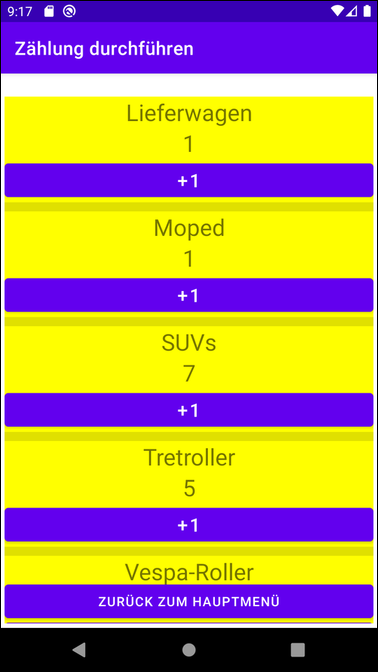

# Android-App "Verkehrszähler mit Room" #

 

Simple Android app that demonstrates persistency with [Room](https://developer.android.com/training/data-storage/room/) (Android's ORM) for a traffic counter app.

There is also a variant of this app which does use SQLite directly (i.e. does not use Room), see [this repository](https://github.com/MDecker-MobileComputing).

 

----

## Screenshots ##

 &nbsp; 

 

----

## License ##

 

See the [LICENSE file](LICENSE.md) for license rights and limitations (BSD 3-Clause License).

 
